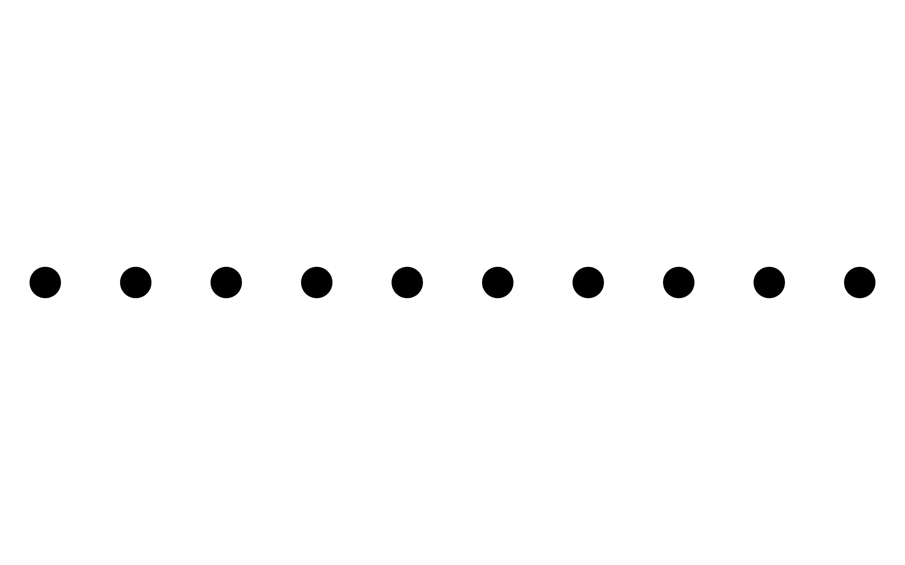
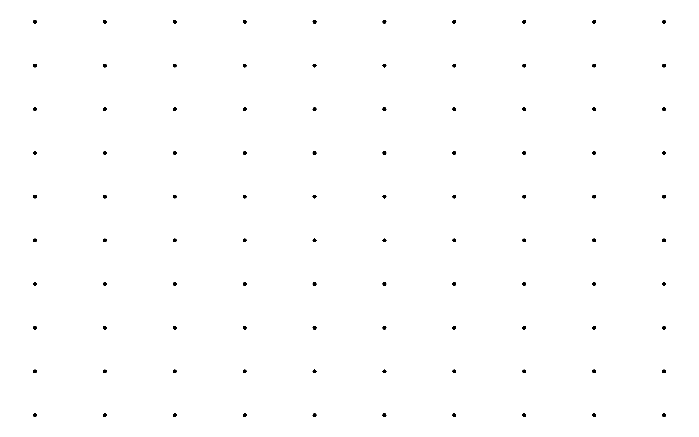
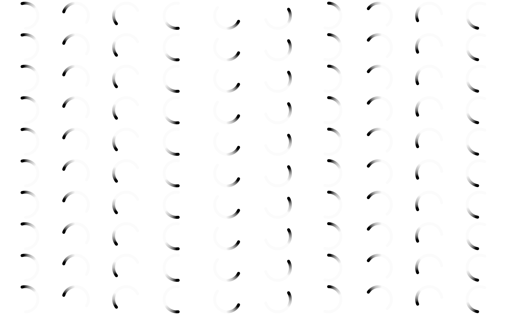
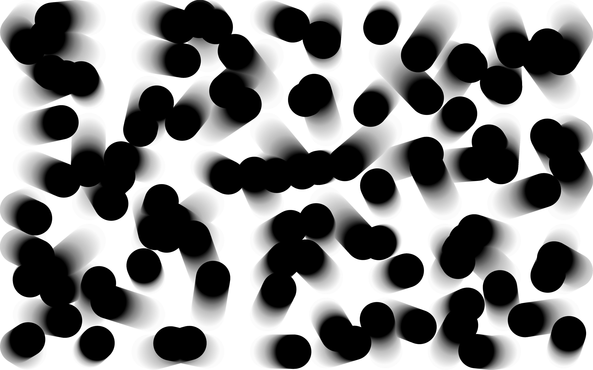
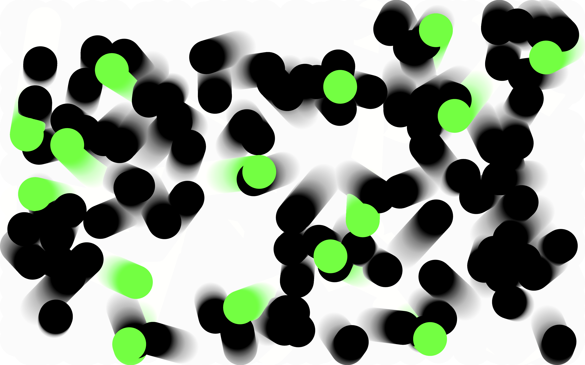
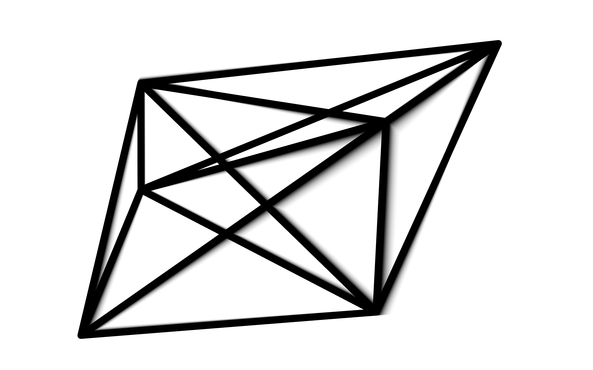

# Mise à niveau Creative Coding 2024

## Exercices P5 / Creative Coding

### Exercice 1 - line

From 1 circle to 10

### Exercice 2 - grid

From 10 circle to 100

### Exercice 3 - basic animation

Animate each circle in an ordered way

### Exercice 4 - advanced animation

Animate each circle in a disordered way

### Exercice 5 - basic interactions

Make some circle appearing and disappearing

### Exercice 6 - Classic Edition - Line Between

Make this classic sketch based on the exercices you've made before

### Exercice 7 - Classic Edition - Line Between All

Try to rely each point with each other

